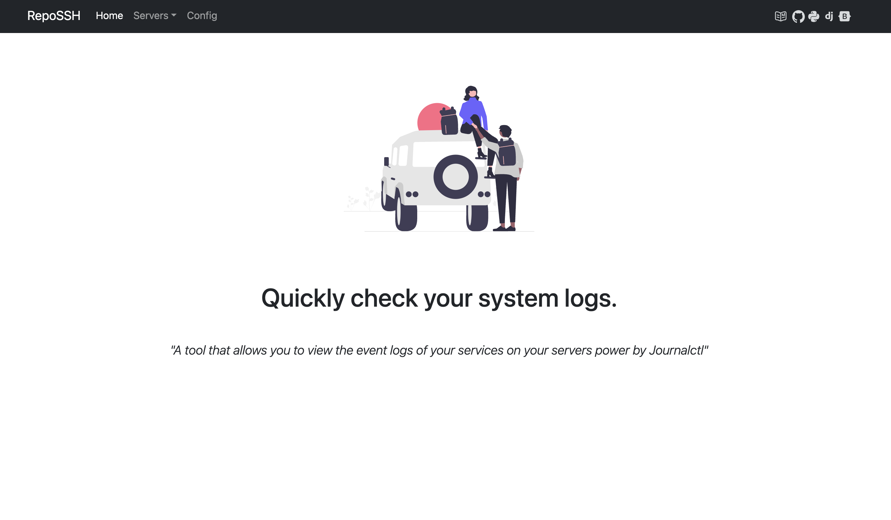
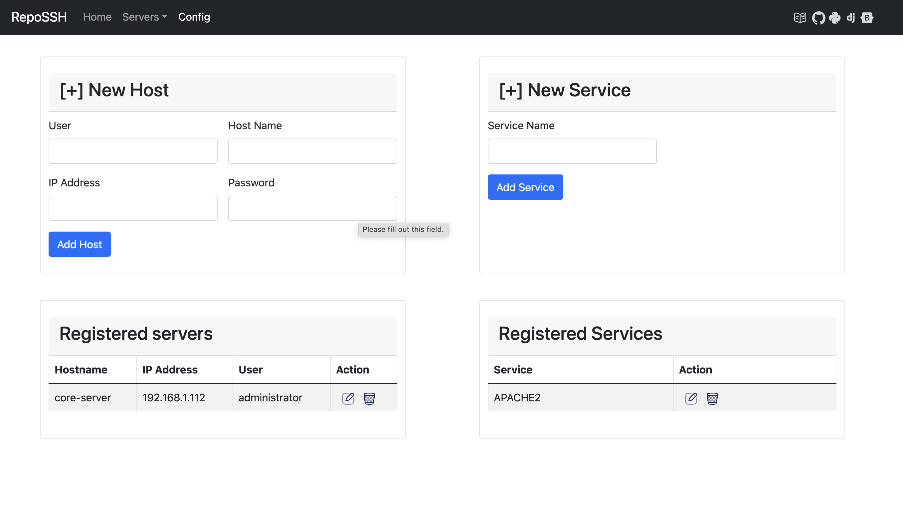
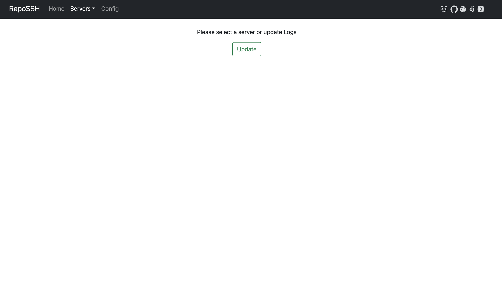
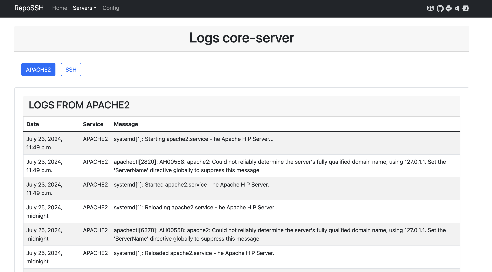

# RepoSSHv

*A tool that allows you to view the event logs of your services on your servers power by Journalctl* 

## Description

You can use this application to quickly view your server logs. Just register the servers with their IP addresses, usernames, and passwords. Add the services you want to monitor.

This application will store the logs locally in a database for future reference at any time.

### CAUTION

**Please note that this application has been developed for the purpose of practicing the Django framework, so it is not recommended for use in production environments.**

### How to run:

* Clone the application:
```
git clone https://github.com/YaafarDiaz/repossh.git
```
* Install the dependencies:
```
pip install -r requirements.txt
```
* Create a superuser
```
python manage.py createsuperuser
```
* Run the application
```
python manage.py runserver
```

### Preview:

##### Home view

##### Config view

##### Update View

##### Logs view



### Technologies used:

* [Django](https://www.djangoproject.com/).
* [Paramiko](https://www.paramiko.org/).
* [JournalCTL](https://www.freedesktop.org/software/systemd/man/latest/journalctl.html).
* [Bootstrap](https://getbootstrap.com/).

